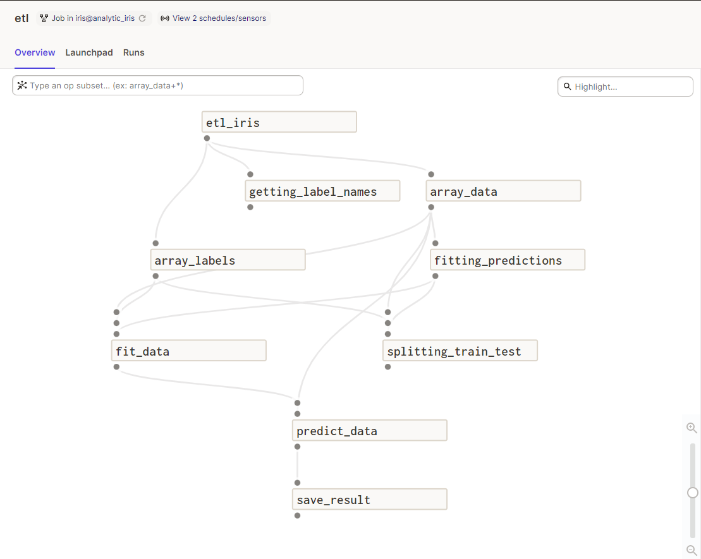

# analytic_iris

Welcome to your new Dagster repository.

### Contents

| Name                     | Description                                                                       |
| ------------------------ | --------------------------------------------------------------------------------- |
| `README.md`              | A description and guide for this code repository                                  |
| `setup.py`               | A build script with Python package dependencies for this code repository          |
| `workspace.yaml`         | A file that specifies the location of the user code for Dagit and the Dagster CLI |
| `analytic_iris/`       | A Python directory that contains code for your Dagster repository                 |
| `analytic_iris_tests/` | A Python directory that contains tests for `analytic_iris`                      |



## Getting up and running

1. Create a new Python environment and activate.

**Pyenv**
```bash
export PYTHON_VERSION=X.Y.Z
pyenv install $PYTHON_VERSION
pyenv virtualenv $PYTHON_VERSION analytic_iris
pyenv activate analytic_iris
```

**Conda**
```bash
export PYTHON_VERSION=X.Y.Z
conda create --name analytic_iris python=PYTHON_VERSION
conda activate analytic_iris
```

2. Once you have activated your Python environment, install your repository as a Python package. By
using the `--editable` flag, `pip` will install your repository in
["editable mode"](https://pip.pypa.io/en/latest/reference/pip_install/?highlight=editable#editable-installs)
so that as you develop, local code changes will automatically apply.

```bash
pip install --editable .
```

## Local Development

1. Set the `DAGSTER_HOME` environment variable. Dagster will store run history in this directory.

```base
mkdir ~/dagster_home
export DAGSTER_HOME=~/dagster_home
```

2. Start the [Dagit process](https://docs.dagster.io/overview/dagit). This will start a Dagit web
server that, by default, is served on http://localhost:3000.

```bash
dagit
```

3. (Optional) If you want to enable Dagster
[Schedules](https://docs.dagster.io/overview/schedules-sensors/schedules) or
[Sensors](https://docs.dagster.io/overview/schedules-sensors/sensors) for your jobs, start the
[Dagster Daemon process](https://docs.dagster.io/overview/daemon#main) **in a different shell or terminal**:

```bash
dagster-daemon run
```

## Local Testing

Tests can be found in `analytic_iris_tests` and are run with the following command:

```bash
pytest analytic_iris_tests
```

As you create Dagster ops and graphs, add tests in `analytic_iris_tests/` to check that your
code behaves as desired and does not break over time.

For hints on how to write tests for ops and graphs in Dagster,
[see our documentation tutorial on Testing](https://docs.dagster.io/tutorial/testable).
